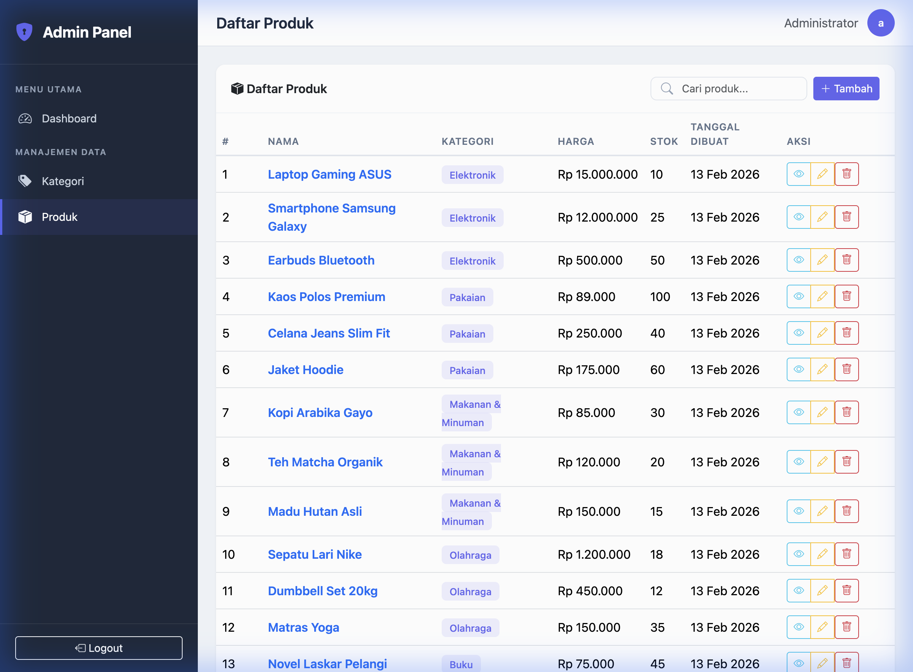

# Admin Panel NestJS

Admin panel untuk manajemen data **Kategori** dan **Produk** dengan fitur autentikasi, CRUD, pencarian, dan error handling. Dibangun menggunakan **NestJS TypeScript** dengan pattern **MVC** (Model-View-Controller).

## Fitur Utama

- ✅ **Autentikasi** — Login/logout dengan session-based authentication (Passport.js + bcrypt)
- ✅ **CRUD Kategori** — Tambah, lihat, edit, hapus kategori
- ✅ **CRUD Produk** — Tambah, lihat, edit, hapus produk (dengan pilihan kategori)
- ✅ **Relasi One-to-Many** — Satu kategori memiliki banyak produk
- ✅ **Pencarian** — Fitur search pada halaman kategori dan produk
- ✅ **MVC Pattern** — Model (Entity + Service), View (Handlebars), Controller
- ✅ **Error Handling** — Global exception filter, validasi form, halaman error
- ✅ **Responsive UI** — Desain modern dengan sidebar navigation

## Desain Database

```
┌──────────────────┐           ┌──────────────────────┐
│      User        │           │      Category         │
├──────────────────┤           ├──────────────────────┤
│ id        PK     │           │ id          PK        │
│ username  UNIQUE │           │ name                  │
│ password  HASH   │           │ description           │
│ fullName         │           │ createdAt             │
└──────────────────┘           │ updatedAt             │
                               └──────────┬───────────┘
                                          │ 1
                                          │
                                          │ *
                               ┌──────────┴───────────┐
                               │      Product          │
                               ├──────────────────────┤
                               │ id          PK        │
                               │ name                  │
                               │ description           │
                               │ price       DECIMAL   │
                               │ stock       INT       │
                               │ categoryId  FK        │
                               │ createdAt             │
                               │ updatedAt             │
                               └──────────────────────┘
```

**Relasi:** Category (1) → Product (*) — One to Many

## Screenshot Aplikasi

### Halaman Login


### Dashboard


### Daftar Produk


## Arsitektur MVC

```
src/
├── entities/                  # MODEL — Database entities (TypeORM)
│   ├── user.entity.ts
│   ├── category.entity.ts
│   └── product.entity.ts
├── category/
│   ├── category.module.ts
│   ├── category.service.ts    # MODEL — Business logic & data access
│   ├── category.controller.ts # CONTROLLER — Route handling
│   └── dto/
│       └── create-category.dto.ts
├── product/
│   ├── product.module.ts
│   ├── product.service.ts     # MODEL — Business logic & data access
│   ├── product.controller.ts  # CONTROLLER — Route handling
│   └── dto/
│       └── create-product.dto.ts
├── auth/                      # Authentication module
│   ├── auth.module.ts
│   ├── auth.service.ts
│   ├── auth.controller.ts
│   ├── local.strategy.ts
│   ├── session.serializer.ts
│   └── guards/
├── seed/                      # Database seeder
│   ├── seed.module.ts
│   └── seed.service.ts
├── filters/
│   └── http-exception.filter.ts  # Global error handling
├── app.module.ts
├── app.controller.ts          # Dashboard controller
└── main.ts                    # Bootstrap & configuration

views/                         # VIEW — Handlebars templates
├── layouts/
│   └── main.hbs               # Layout utama dengan sidebar
├── login.hbs
├── dashboard.hbs
├── categories/
│   ├── list.hbs
│   ├── detail.hbs
│   └── form.hbs
├── products/
│   ├── list.hbs
│   ├── detail.hbs
│   └── form.hbs
└── error.hbs
```

## Dependencies

| Package | Versi | Fungsi |
|---------|-------|--------|
| `@nestjs/core` | ^11.x | Framework core |
| `@nestjs/typeorm` | ^11.x | ORM integration |
| `typeorm` | ^0.3.x | Database ORM |
| `sqlite3` | ^5.x | SQLite database driver |
| `@nestjs/passport` | ^11.x | Authentication framework |
| `passport` | ^0.7.x | Auth strategies |
| `passport-local` | ^1.x | Username/password strategy |
| `bcrypt` | ^5.x | Password hashing |
| `hbs` | ^4.x | Handlebars view engine |
| `express-session` | ^1.x | Session management |
| `class-validator` | ^0.14.x | DTO validation |
| `class-transformer` | ^0.5.x | DTO transformation |

## Cara Menjalankan

### Prerequisites
- Node.js >= 18
- npm >= 9

### Instalasi

```bash
# Clone repository
git clone <repository-url>
cd challenge

# Install dependencies
npm install

# Jalankan dalam mode development
npm run start:dev
```

Aplikasi akan berjalan di **http://localhost:3000**

### Login Default
- **Username:** `admin`
- **Password:** `admin123`

## API Endpoints

| Method | URL | Deskripsi |
|--------|-----|-----------|
| GET | `/login` | Halaman login |
| POST | `/login` | Proses login |
| GET | `/logout` | Logout |
| GET | `/` | Dashboard |
| GET | `/categories` | Daftar kategori |
| GET | `/categories/create` | Form tambah kategori |
| POST | `/categories` | Simpan kategori baru |
| GET | `/categories/:id` | Detail kategori |
| GET | `/categories/:id/edit` | Form edit kategori |
| POST | `/categories/:id` | Update kategori |
| POST | `/categories/:id/delete` | Hapus kategori |
| GET | `/products` | Daftar produk |
| GET | `/products/create` | Form tambah produk |
| POST | `/products` | Simpan produk baru |
| GET | `/products/:id` | Detail produk |
| GET | `/products/:id/edit` | Form edit produk |
| POST | `/products/:id` | Update produk |
| POST | `/products/:id/delete` | Hapus produk |

> **Pencarian:** Tambahkan query parameter `?search=keyword` pada endpoint list kategori/produk.

## Error Handling

1. **Global Exception Filter** (`HttpExceptionFilter`) — menangkap semua exception dan merender halaman error
2. **Validation** — menggunakan `class-validator` pada DTO, error ditampilkan di form
3. **404 Not Found** — halaman error untuk resource yang tidak ditemukan
4. **401/403 Unauthorized** — redirect otomatis ke halaman login
5. **500 Server Error** — halaman error generik untuk kesalahan server

## Teknologi

- **Runtime:** Node.js
- **Framework:** NestJS 11 (TypeScript)
- **Database:** SQLite (via TypeORM)
- **View Engine:** Handlebars (HBS)
- **Auth:** Passport.js (Local Strategy + Sessions)
- **Styling:** Bootstrap 5 + Bootstrap Icons + Custom CSS

## Catatan untuk Developer

- Database menggunakan **SQLite** (`database.sqlite`) yang otomatis dibuat saat pertama kali dijalankan
- Seed data otomatis diisi saat pertama kali (1 admin, 5 kategori, 15 produk)
- Hapus file `database.sqlite` untuk reset database
- Session disimpan di memory (restart server = session hilang)
- Pattern MVC: Entity + Service = Model, Controller = Controller, `.hbs` = View
