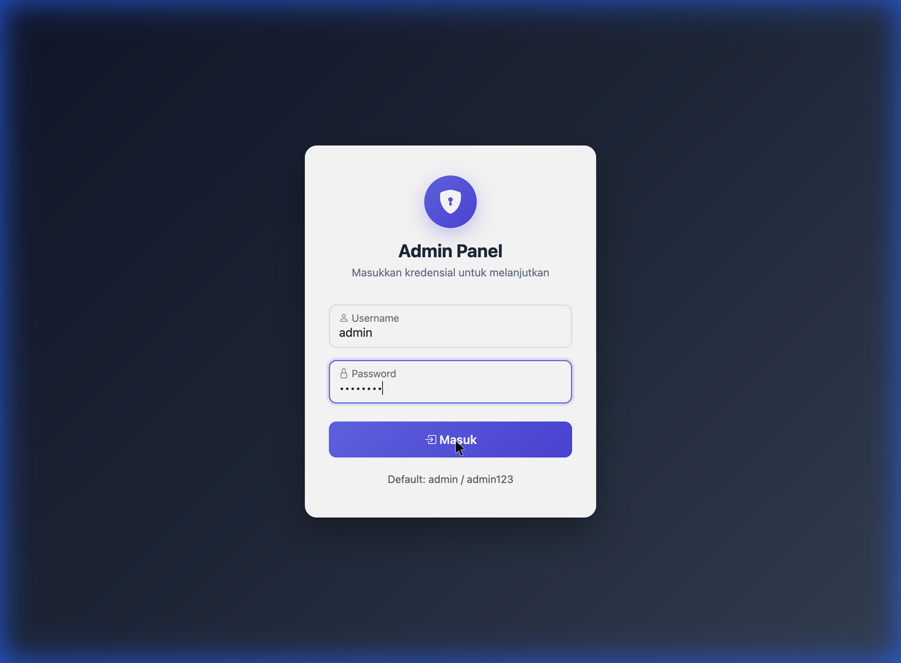
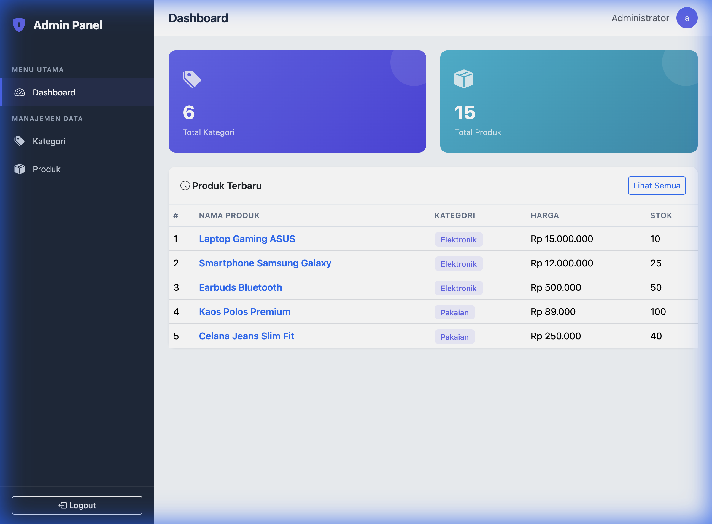
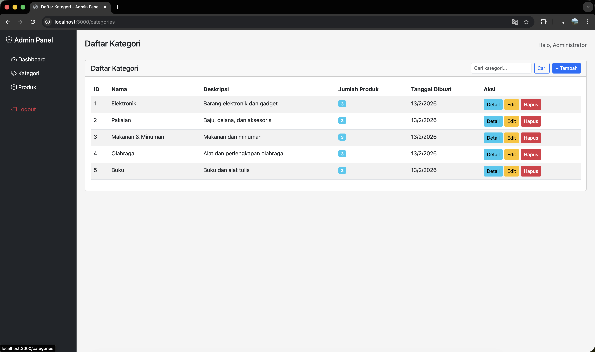
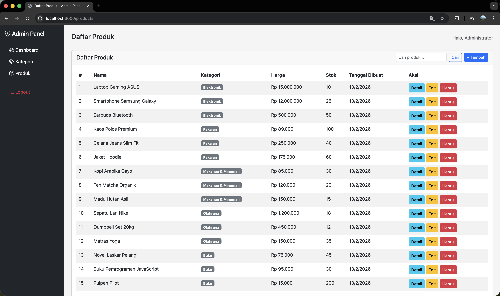

# Admin Panel - NestJS MVC Application

Admin panel untuk manajemen data kategori dan produk dengan fitur login, CRUD lengkap, dan pencarian data menggunakan pattern MVC.

## 📋 Deskripsi Project

Aplikasi web admin panel berbasis NestJS yang memungkinkan pengelolaan data kategori dan produk. Aplikasi ini menggunakan pattern MVC (Model-View-Controller) dengan server-side rendering menggunakan Handlebars, dilengkapi dengan autentikasi berbasis session dan fitur pencarian data.

### Fitur Utama

- ✅ **Authentication** - Login dengan session-based authentication
- ✅ **Category Management** - CRUD lengkap untuk kategori
- ✅ **Product Management** - CRUD lengkap untuk produk
- ✅ **Search Functionality** - Pencarian untuk kategori dan produk
- ✅ **One-to-Many Relationship** - Relasi kategori ke produk
- ✅ **MVC Pattern** - Implementasi pattern Model-View-Controller
- ✅ **Server-side Rendering** - Semua response berbentuk halaman HTML
- ✅ **Error Handling** - User-friendly error messages
- ✅ **Responsive UI** - Menggunakan Bootstrap 5

## 🗄️ Database Design

Aplikasi menggunakan SQLite dengan 3 tabel utama:


### Entity Relationship

```
User (1) ─────────────────────────────────────────────
  │
  └─ id, username, password (hashed)

Category (1) ────────────┐
  │                       │ One-to-Many
  ├─ id                   │
  ├─ name                 │
  └─ description          │
                          │
                          ├──> Product (Many)
                          │      │
                          │      ├─ id
                          │      ├─ name
                          │      ├─ description
                          │      ├─ price
                          │      ├─ stock
                          │      └─ categoryId (FK)
                          │
```

### Relasi Antar Tabel

- **User** → Untuk autentikasi admin
- **Category** → `One-to-Many` → **Product**
  - Satu kategori bisa memiliki banyak produk
  - Produk harus memiliki satu kategori (required)

## 📸 Screenshots

### Login Page

*Halaman login dengan validasi kredensial*

### Dashboard

*Dashboard dengan statistik total kategori, produk, dan daftar produk terbaru*

### Category Management

*Halaman daftar kategori dengan fitur search dan CRUD operations*

### Product Management

*Halaman daftar produk dengan fitur search, filter kategori, dan CRUD operations*

## 🛠️ Dependencies

### Core Dependencies

```json
{
  "@nestjs/common": "^10.0.0",
  "@nestjs/core": "^10.0.0",
  "@nestjs/platform-express": "^10.0.0",
  "@nestjs/typeorm": "^10.0.0",
  "typeorm": "^0.3.17",
  "sqlite3": "^5.1.6"
}
```

### Authentication

```json
{
  "@nestjs/passport": "^10.0.0",
  "passport": "^0.6.0",
  "passport-local": "^1.0.0",
  "express-session": "^1.17.3",
  "bcrypt": "^5.1.1"
}
```

### View Engine

```json
{
  "hbs": "^4.2.0",
  "express": "^4.18.2"
}
```

### Development Dependencies

```json
{
  "@nestjs/cli": "^10.0.0",
  "@types/node": "^20.3.1",
  "@types/express": "^4.17.17",
  "@types/passport-local": "^1.0.35",
  "@types/bcrypt": "^5.0.0",
  "typescript": "^5.1.3"
}
```

## ⚙️ Installation & Setup

### Prerequisites

- Node.js (v18 atau lebih baru)
- npm atau yarn

### Langkah-langkah Setup

1. **Clone repository**
   ```bash
   git clone https://github.com/dafatsq/adminpanel.git
   cd adminpanel
   ```

2. **Install dependencies**
   ```bash
   npm install
   ```

3. **Build aplikasi**
   ```bash
   npm run build
   ```

4. **Jalankan aplikasi**
   ```bash
   npm start
   ```

   Atau untuk development dengan auto-reload:
   ```bash
   npm run start:dev
   ```

5. **Akses aplikasi**
   - Buka browser dan akses: `http://localhost:3000`
   - Login dengan kredensial default:
     - **Username:** `admin`
     - **Password:** `admin123`

### Seed Data

Aplikasi akan otomatis membuat database dan seed data saat pertama kali dijalankan, termasuk:
- 1 user admin (admin/admin123)
- 5 kategori sample
- 15 produk sample

## 📁 Struktur Project (MVC Pattern)

```
src/
├── entities/              # MODEL - Database Schema
│   ├── user.entity.ts
│   ├── category.entity.ts
│   └── product.entity.ts
│
├── auth/                  # Auth Module
│   ├── auth.controller.ts      # CONTROLLER
│   ├── auth.service.ts         # MODEL (Business Logic)
│   ├── guards/
│   │   ├── login.guard.ts
│   │   └── authenticated.guard.ts
│   └── strategies/
│       └── local.strategy.ts
│
├── category/              # Category Module
│   ├── category.controller.ts  # CONTROLLER
│   └── category.service.ts     # MODEL (Business Logic)
│
├── product/               # Product Module
│   ├── product.controller.ts   # CONTROLLER
│   └── product.service.ts      # MODEL (Business Logic)
│
├── seed/                  # Seed Data Module
│   └── seed.service.ts
│
├── app.controller.ts      # Dashboard Controller
├── app.module.ts          # Root Module
└── main.ts                # Entry Point

views/                     # VIEW - Templates (Handlebars)
├── layouts/
│   └── main.hbs          # Main layout dengan sidebar
├── login.hbs             # Login page
├── dashboard.hbs         # Dashboard page
├── categories/           # Category views
│   ├── list.hbs
│   ├── detail.hbs
│   └── form.hbs
└── products/             # Product views
    ├── list.hbs
    ├── detail.hbs
    └── form.hbs
```

## 🎯 Implementasi Pattern MVC

### Model Layer
**Location:** `src/entities/` & `src/*/service.ts`

- **Entities** - Definisi struktur database (TypeORM)
- **Services** - Business logic dan data access layer

```typescript
// Example: Product Service (Model)
async findAll(search?: string) {
  if (search) {
    return this.productRepository.find({
      where: [
        { name: Like(`%${search}%`) },
        { description: Like(`%${search}%`) }
      ],
      relations: ['category']
    });
  }
  return this.productRepository.find({ relations: ['category'] });
}
```

### View Layer
**Location:** `views/`

- Template Handlebars untuk rendering HTML
- Layout system dengan sidebar navigation
- Responsive dengan Bootstrap 5

```handlebars
<!-- Example: Product List View -->
{{#each products}}
  <tr>
    <td>{{this.name}}</td>
    <td>{{this.category.name}}</td>
    <td>{{formatPrice this.price}}</td>
  </tr>
{{/each}}
```

### Controller Layer
**Location:** `src/*/*.controller.ts`

- Handle HTTP requests
- Memanggil Service (Model)
- Render View dengan data

```typescript
// Example: Product Controller
@Get()
async list(@Query('search') search: string, @Res() res: Response) {
  const products = await this.productService.findAll(search);
  return res.render('products/list', {
    title: 'Daftar Produk',
    products,
    search
  });
}
```

## 🔍 Fitur Pencarian

Pencarian diimplementasikan di 3 layer:

1. **View** - Form search dengan input field
2. **Controller** - Menerima query parameter `?search=keyword`
3. **Service** - Query database dengan TypeORM `Like()`

### Endpoint Pencarian

- **Categories:** `GET /categories?search=elektronik`
- **Products:** `GET /products?search=laptop`

Pencarian mencakup kolom:
- Kategori: `name`, `description`
- Produk: `name`, `description`

## 🛡️ Error Handling

Aplikasi mengimplementasikan error handling yang user-friendly:

### 1. Authentication Errors
- Login gagal → Redirect ke `/login?error=...` dengan alert merah
- Belum login → Redirect ke `/login` (tidak show 403 JSON)

### 2. Validation Errors
- Form input kosong → Render ulang form dengan error messages
- Data tidak valid → Alert merah dengan daftar error

### 3. Not Found Errors
- Data tidak ditemukan → Redirect ke halaman list

### 4. Success Messages
- Action berhasil → Redirect dengan `?success=...` dan alert hijau

**Semua error ditampilkan sebagai halaman HTML, tidak ada response JSON.**

## 🔐 Authentication & Authorization

### Session-based Authentication
- Menggunakan Passport.js dengan `passport-local` strategy
- Password di-hash dengan bcrypt
- Session disimpan di `express-session`

### Protected Routes
Semua route kecuali `/login` memerlukan autentikasi. Implementasi menggunakan manual check di setiap controller method:

```typescript
if (!req.isAuthenticated()) {
  return res.redirect('/login');
}
```

## 🚀 API Endpoints

Meskipun ini MVC app (bukan REST API), berikut daftar endpoint yang tersedia:

### Authentication
- `GET /login` - Tampilkan form login
- `POST /login` - Proses login
- `GET /logout` - Logout

### Dashboard
- `GET /` - Dashboard dengan statistik

### Categories
- `GET /categories` - List semua kategori
- `GET /categories?search=keyword` - Search kategori
- `GET /categories/create` - Form tambah kategori
- `POST /categories` - Simpan kategori baru
- `GET /categories/:id` - Detail kategori
- `GET /categories/:id/edit` - Form edit kategori
- `POST /categories/:id` - Update kategori
- `POST /categories/:id/delete` - Hapus kategori

### Products
- `GET /products` - List semua produk
- `GET /products?search=keyword` - Search produk
- `GET /products/create` - Form tambah produk
- `POST /products` - Simpan produk baru
- `GET /products/:id` - Detail produk
- `GET /products/:id/edit` - Form edit produk
- `POST /products/:id` - Update produk
- `POST /products/:id/delete` - Hapus produk

**Note:** Semua endpoint mengembalikan HTML page atau redirect, **bukan JSON response**.

## 👨‍💻 Development Tips

### Reset Database
Untuk reset database dan seed ulang:

```bash
# Stop aplikasi
# Hapus database
rm database.sqlite

# Jalankan ulang, database akan dibuat dan seed otomatis
npm start
```

### Default Credentials
- Username: `admin`
- Password: `admin123`

### Port Configuration
Aplikasi berjalan di port `3000` secara default. Bisa diubah di `src/main.ts`.

## 📝 Notes untuk Developer

### Conventions
- **File naming:** kebab-case untuk files (e.g., `product.controller.ts`)
- **Class naming:** PascalCase untuk classes (e.g., `ProductController`)
- **Comments:** Menggunakan bahasa Indonesia untuk readability
- **Validation:** Inline validation dengan if-checks (simple approach)

### Code Style
- Kode ditulis dengan gaya "intern-friendly" - simple dan mudah dipahami
- Menggunakan type `any` di beberapa tempat untuk simplicity
- Inline validation tanpa class-validator decorators
- Komentar dalam bahasa Indonesia

### Database
- SQLite file: `database.sqlite` (auto-generated)
- TypeORM synchronize: `true` (auto-create tables)
- Seed data akan dibuat otomatis saat startup pertama kali

## 🤝 Contributing

Untuk kontribusi atau pengembangan lebih lanjut:

1. Fork repository ini
2. Buat branch baru (`git checkout -b feature/AmazingFeature`)
3. Commit changes (`git commit -m 'Add some AmazingFeature'`)
4. Push ke branch (`git push origin feature/AmazingFeature`)
5. Buat Pull Request

## 📄 License

Project ini dibuat untuk keperluan pembelajaran dan evaluasi teknis.

## 📞 Contact

Repository: [https://github.com/dafatsq/adminpanel](https://github.com/dafatsq/adminpanel)

---

**Built with ❤️ using NestJS and TypeScript**
